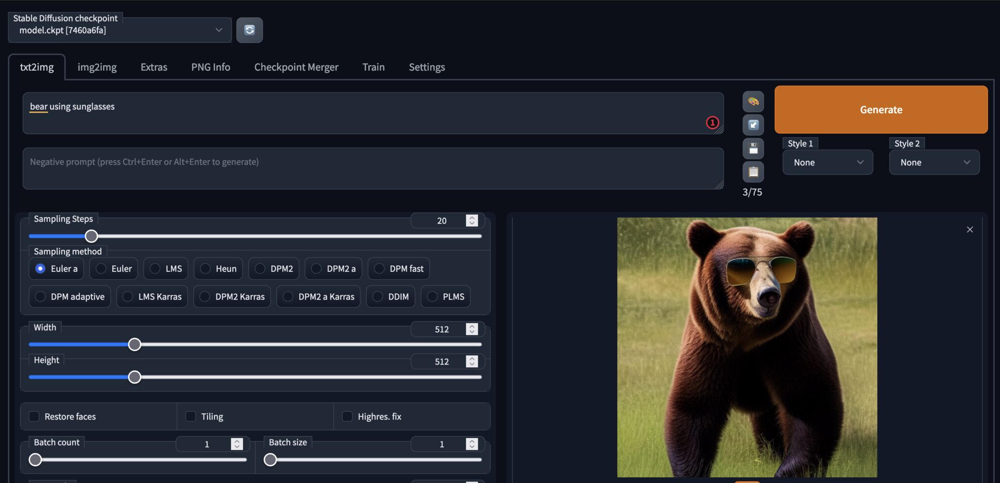

# Automatic1111 in OCI
Terraform script to start **automatic1111** in OCI using a nvidia GPU.

## Requirements
- Terraform
- ssh-keygen

## Configuration

1. Follow the instructions to add the authentication to your tenant https://medium.com/@carlgira/install-oci-cli-and-configure-a-default-profile-802cc61abd4f.
2. Clone this repository:
    ```bash
    git clone https://github.com/carlgira/oci-automatic1111
    ```

3. Set three variables in your path. 
- Copy the output of the following command as the tenancy OCID:
    ```bash
    <copy>echo $OCI_TENANCY</copy>
    ```
- The comparment OCID where the instance will be created. If you're using the root compartment, it'll be the same as the tenancy OCID.
- The "Region Identifier" of region of your tenancy:
    ```bash
    <copy>echo $OCI_REGION</copy>
    ``` 

> **Note**: [More info on the list of available regions here.](https://docs.oracle.com/en-us/iaas/Content/General/Concepts/regions.htm)

```bash
export TF_VAR_tenancy_ocid='<tenancy-ocid>'
export TF_VAR_compartment_ocid='<comparment-ocid>'
export TF_VAR_region='<oci-region>'
```

0. If you're using a Linux OS, you may need to execute the following command to obtain execution permissions on the shell script:
    ```bash
    chmod a+x generate-keys.sh
    ```
1. Execute the script generate-keys.sh to generate private key to access the instance. You may 
    ```bash
    sh generate-keys.sh
    ```

## Build

To build the terraform solution, simply execute: 
```bash
terraform init
terraform plan
terraform apply
```

**After applying, the service will be ready in about 25 minutes.** (it will install OS dependencies, NVIDIA drivers, and install _`automatic1111`_ with some extensions).

## Post-Configuration
To test the app, you need to create an SSH Tunnel to port **7860** to to use _`automatic1111`. The output of the terraform script will give the SSH command you need to execute, so you only need to copy and paste the following:

```bash
ssh -i server.key -L 7860:localhost:7860 opc@<instance-public-ip>
```

## Testing
Make sure to have the SSH tunnel open, in order to access the application.

From within the machine, go to http://localhost:7860, in the top text area write and idea, and stable diffusion will try to draw it on screen. 



Use [Lexica Art](https://lexica.art/) for examples of promts that you can use.


## Extensions

With the solution, some additional extensions are available for you so you can play around:

- [**OutPaint**](https://github.com/zero01101/openOutpaint-webUI-extension)
- [**Deforum**](https://github.com/deforum-art/deforum-for-automatic1111-webui)
- [**Image Browser**](https://github.com/yfszzx/stable-diffusion-webui-images-browser)

## Cleaning 

After you're done with everything, we can clear the Terraform deployment, by running:

```bash
terraform destroy
```

## Troubleshooting

1. If the service _`automatic1111.service`_ is down, check the logs and the state of each service, with the following commands:

    ```bash
    systemctl status automatic1111.service
    ```

    You can try starting the service by running:

    ```bash
    sudo systemctl start <service-name>
    ```

2. Error ***Error: 404-NotAuthorizedOrNotFound, shape VM.GPU2.1 not found***.
   
    This could be happening because, in your availability domain (AD) there is no _`VM.GPU2.1`_ shape available. The script uses the first Availability Domain by default, but you may need to change to another AD if you're still running into issues.

    To get a list of ADs within your tenancy:

    ```bash
    oci iam availability-domain list
    ```

    In the main.tf file, change the index number from `0` to another index corresponding to any other AD within your region, in case your region has more than one AD.

    ```bash
    availability_domain = data.oci_identity_availability_domains.ADs.availability_domains[0].name
    ```

    This error can also happen if there is no _`VM.GPU2.1`_ shape available in your region. In that case, you have to change the `region` environment va riable before retrying:

    ```bash
    export TF_VAR_region='<other-region>'
    ```

3. You're getting the following error:
    ```
    │ Error: 403-NotAllowed, Please go to your home region FRA to execute CREATE, UPDATE and DELETE operations.
    │ Suggestion: Please retry or contact support for help with service: Identity Policy
    ```

    Solution: make sure you are in the home region when running the Terraform script. If it is a trial, you will be on the home region. Move to your home region and try again.

## Acknowledgements

* **Author** - [Carlos Giraldo](https://www.linkedin.com/in/carlos-giraldo-a79b073b/), Oracle
* **Last Updated Date** - February 7th, 2023
* **Code Base** - [The automatic1111 project](https://github.com/AUTOMATIC1111/)